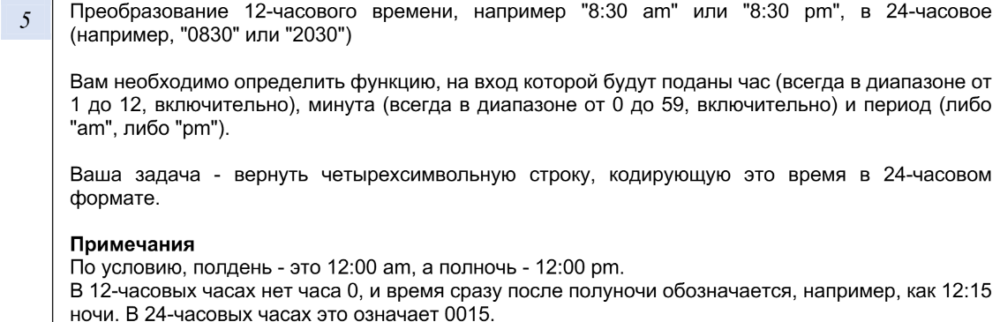

Кудрявцев Егор Алексеевич М8О-211БВ-24
Вариант 5



# C++ Project Build Guide

This project uses **CMake** as the build system.

---

## 1. Create build directory
It’s recommended to keep build files separate from source files.

```bash
mkdir build
cd build
````

---

## 2. Configure project with CMake

Run CMake to generate build files (default generator depends on your system).

```bash
cmake ..
```

If you want a specific build type (e.g., Release):

```bash
cmake -DCMAKE_BUILD_TYPE=Release ..
```

---

## 3. Build the project

Compile sources with:

```bash
cmake --build .
```

---

## 4. Run the program

After a successful build, run the executable.
If your target is named **time\_converter\_tests**, do:

```bash
./main
./time_converter_tests
```

(on Windows: `main.exe` `time_converter_tests.exe`).

---

## Notes

* Make sure you have **CMake ≥ 3.x** and a C++ compiler installed (e.g., GCC, Clang, MSVC).
* To clean build files, just remove the `build/` directory and repeat steps above.
